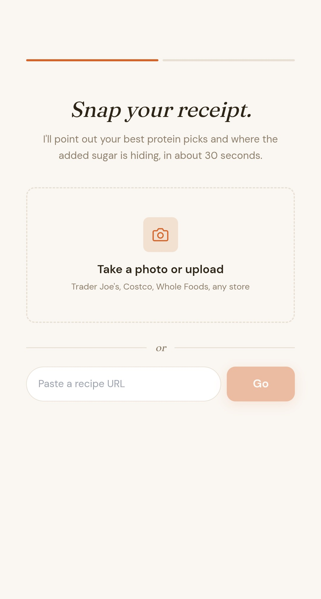
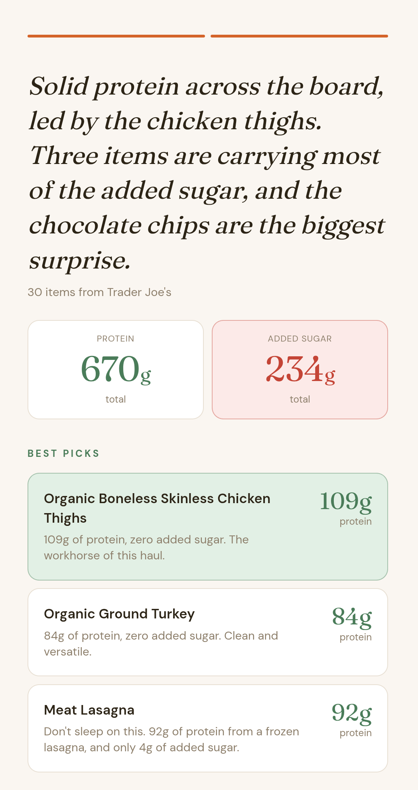

# Protein

 

Snap a picture of your grocery receipt to see how much protein and added sugar you are taking home. Be surprisingly proud about taking home the ready-made lasagna or think again before buying hamburger buns with 3x more added sugar than sliced white bread. 

**[Try the prototype →](https://protein-silk.vercel.app/)**

 
---

## Core bet
*Co-written with AI after much prompting and experimenting with the app.*

**The app is a reveal, not judgment.** If we can turn a receipt into a short, specific narration of what's in their cart, people will learn something new and naturally change their behavior on their own, without being told to.

The Protein app:

1. **Highlights your best picks.** Protein celebrates the real food you bought ("95g protein, zero added sugar, under 800 cal.") which frankly, no one else does for you.  
2. **Shares where the added sugar is hiding, without judgment.** The items adding most of the added sugar may be the ones you'd never guess. Hamburger buns. Flavored yogurt. Sausage. Granola. That "wait, *really*?" reaction is a moment of reflection, not shame.

**A note on "sugar":** throughout this app, when we say "sugar" we mean *added sugar*: the AHA / USDA definition that excludes natural sugars in whole fruit, plain dairy, and vegetables. A bunch of bananas has ~56g of natural sugar and 0g of added sugar. In user-visible text we say "added sugar" explicitly so nobody thinks we're counting fruit.